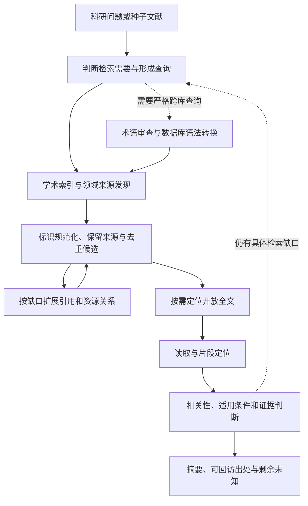

> 历史文档共享副本 · 发布于 2026-09-17。保留当时的结论、失败、限制和计划；旧授权、自动续接、模型配置与“下一步”不作为当前执行指令。科研默认流程以 FS03 为准。已移除内部任务标识、替换本机路径并调整链接；没有重新运行历史验证。

# 科研搜索模块深度调研与整合方案

研究日期：2026-09-15。对象：当前 field-search，以及科研 Skill、学术搜索项目、领域接口与工作流中的搜索节点。

## 结论

**可以组合成 field-search 的科研搜索部分。建议按搜索节点组合，而不是安装多个完整科研代理后再把它们的回答合并。** 本轮识别出的可复用增量包括数据库查询转换、多源论文发现、标识与题录处理、引用扩展、开放全文定位、正文检索，以及需要时启用的检索式反馈。

现有 field-search 已承担问题澄清、按缺口选择路线、公共搜索与原文读取、失败状态和证据交接。科研扩展应补足具体学术检索节点，保留这些现有能力。这里给出的是经公开资料、固定提交源码和少量接口探测支持的**整合设计**；没有安装候选、运行完整科研代理或证明检索收益提升。[当前基线](BASELINE.md)、[源码节点](SOURCE-NODES.md)、接口事实（本地历史引用，未随本批发布：`ACCESS-QUEUE.md`）

## 1. 搜索空间怎样展开

发现阶段先展开再比较，没有以最初的代表项目清单作为上限。采用问题导向查询、仓库与 Skill 目录、原论文的代码链接、依赖和相关项目、维护讨论与失败案例继续扩展。曾经看似缺少实现的反馈式查询，在后续原论文追踪中找到 SearchRefiner、QueryLens、QueryFormulation 和相关基础库，已修正早期判断。主搜索日志（本地历史引用，未随本批发布：`SEARCH-LOG.md`）、[最后一轮方法追踪](DISCOVERY-CLOSURE-METHODS.md)

| 方向 | 纳入的代表与边界 | 详细记录 |
|---|---|---|
| 科研 Skill 与 MCP | Scientific Agent Skills、academic-search、paper-search-mcp、academic-mcp、Paper Chaser 等；区分宿主指令与真实客户端 | [发现图](DISCOVERY-MAP.md) |
| 学术代理与通用工作流 | PaperQA、OpenScholar、Paper Finder、Scitadel、Open Deep Research、STORM、GPT Researcher、n8n 等；只拆相关搜索节点 | [源码节点](SOURCE-NODES.md) |
| 数据源与领域覆盖 | OpenAlex、Semantic Scholar、Crossref、PubMed、Europe PMC、arXiv、ERIC、RePEc、各机构与区域库；不是全部已接通 | [主图](DISCOVERY-MAP.md)、[领域扩展](TRADITIONAL-NODES.md) |
| 查询构建与转换 | search-query、findpapers、litsearchr、transmute、searchbuildR；区分术语生成、语法转换与实际执行 | [传统节点](TRADITIONAL-NODES.md)、[方法追踪](DISCOVERY-CLOSURE-METHODS.md) |
| 引用、筛选与去重 | OpenCitations、引用滚雪球、ASReview、BibDedupe、相关流水线；区分发现新论文与筛已有候选 | [源码节点](SOURCE-NODES.md) |
| 全文与证据定位 | OA resolver、GROBID、MinerU、文内检索及检索增强代理；全文链接不等于证据片段 | [源码节点](SOURCE-NODES.md) |
| 中文与非英语、人文及灰色文献 | 万方、维普、知网路线、CiNii、HAL、KCI、SciELO、机构库、学位库、图书与数字馆藏；保留身份与访问差异 | [扩展发现](EXPANSION-TRADITIONAL.md)、[领域节点](TRADITIONAL-NODES.md) |
| 词表与反馈 | ELSST、TheSoz、SKOS/JSKOS、WOKIE、SearchRefiner、QueryLens、FASTREAD 等；明确领域与语言适用范围 | [词表与反馈](EXPANSION-METHODS.md)、[源码追踪](DISCOVERY-CLOSURE-METHODS.md) |

这些是条目与方法分支，不是互相独立的项目计数。同一项目的多个节点、改名仓库和共享上游均需归并。对未查源码的长尾，只记录发现状态，不按项目介绍补齐能力。

展开结束的依据不是条目数量。覆盖审查提出的传统检索、非英语与灰色文献缺口，已由第二执行分支补入查询工具、区域库、学位及馆藏记录；关系/更新与证据定位缺口，由 B25–B28 的源码和官方关系文档补入；直接查询反馈缺口，最后沿原论文追到 SearchRefiner/QueryLens/QueryFormulation。跨语言完整组合未找到、具体账号未接通和效果未验证作为明确空白保留，不再被误称为“完全没探索该方法”。覆盖审查（本地历史引用，未随本批发布：`COVERAGE-ROUND2.md`）、[传统与领域补查](TRADITIONAL-NODES.md)、B25–B31（本地历史引用，未随本批发布：`SEARCH-LOG.md`）、[最后方法追踪](DISCOVERY-CLOSURE-METHODS.md)

这足以进入本轮架构比较，但不是全网穷尽声明。长尾源码、部分当前服务政策和具体学科效果仍有未知；读者可以沿发现图继续扩展，不能把“本轮未找到”写成“实现不存在”。

## 2. 最重要的重合与互补

### 2.1 多个搜索包装不等于多个独立索引

不同 MCP、Skill 和流水线经常使用 OpenAlex、Semantic Scholar、PubMed、arXiv、Crossref 等同一批上游。它们在字段转换、分页、去重、失败处理或宿主适配上可能有价值，但重复调用不能自动增加独立来源覆盖。比较时应先列底层来源，再看包装层新增什么。[paper-search-mcp](https://github.com/openags/paper-search-mcp)、[findpapers](https://github.com/jonatasgrosman/findpapers)、[Scitadel](https://github.com/vig-os/scitadel)

当前宿主还暴露 Sider Scholar 接口，但本轮调用需要重新认证。不能因为接口存在就算已运行，也不能忽略它而重复建设全部相同功能。公开 API 的小探测与 Skill 本身的集成状态分别记录。[基线与探测](BASELINE.md)

### 2.2 查询改写、语法编译、搜索执行是三个节点

litsearchr 从初始材料提取候选词和共现结构；search-query 将检索式表示为结构化查询并做平台转换；findpapers 还包含数据库执行计划与客户端。它们既有查询构建上的重合，也有可前后相接的关系，不能仅用“都支持 Boolean”判定重复。[litsearchr](https://github.com/elizagrames/litsearchr)、[search-query](https://github.com/CoLRev-Environment/search-query)、[findpapers](https://github.com/jonatasgrosman/findpapers)

SearchRefiner/transmute 提供另一条医学检索路径：解析、结构编辑、种子命中展示和 PubMed/Medline 转换。QueryLens 等进一步处理查询变体与选择。这些是明确存在的实现，但医学词表、数据库和运行资源不能直接泛化到中文社科。[SearchRefiner](https://github.com/ielab/searchrefiner)、[transmute](https://github.com/hscells/transmute)、[固定源码与范围](DISCOVERY-CLOSURE-METHODS.md)

### 2.3 开放发现、文内检索、候选筛选不能相互替代

从外部索引找论文、在已获得的全文集合中找证据，以及给已经检出的题录排序，是不同问题。PaperQA/OpenScholar 的相关检索节点需要结合其语料与运行结构判断；ASReview 的主动学习筛选不能直接算成新增外部搜索源。[PaperQA](https://github.com/future-house/paper-qa)、[OpenScholar](https://github.com/AkariAsai/OpenScholar)、[ASReview](https://github.com/asreview/asreview)

关键词、BM25、向量检索、融合和重排也应按所处理的候选集区分。融合可以改变排序，却不能补回上游从未取回的记录；向量与重排的模型、索引和语料成本必须另计。[已审混合检索节点](SOURCE-NODES.md)

### 2.4 去重与研究关系处理互补

重复题录可以按标识和其他字段核对；版本、补充材料、派生数据与同一研究的多个报告应保留关系。BibDedupe 的候选配对和不确定匹配，与 academic-search 的标识规范化、可能重复标记及来源保留可以提供实现思路，但不能把相似标题自动提升为“同一研究”。[BibDedupe](https://github.com/CoLRev-Environment/bib-dedupe)、[academic-search](https://github.com/ustc-ai4science/academic-search)

Crossref、DataCite、OpenAIRE/Scholix 的关系记录属于可查询元数据；缺少记录不证明不存在关系，记录存在也不等于证据支持关系。[DataCite API](https://support.datacite.org/docs/api-queries)、[OpenAIRE](https://graph.openaire.eu/docs/)

### 2.5 全文入口与原文定位构成连续步骤

OA resolver 从 DOI 或元数据寻找可用位置；现有公共网页 reader 取得可读内容；GROBID/MinerU 等处理 PDF 的结构与位置；后续检索器才在取得的正文中找片段。只返回 PDF URL、只完成文本抽取或只生成带引文回答，都不代表完整链条已经成立。[GROBID](https://github.com/kermitt2/grobid)、[MinerU](https://github.com/opendatalab/MinerU)、[OA 与定位源码](SOURCE-NODES.md)

### 2.6 词表与反馈有成熟部件，全集成仍待验证

词表标签、跨词表映射、译词、数据库字段语法和相关反馈分别有实现。最后的定向追踪找到了医学领域的多项查询反馈子方法；尚未发现并验证一个通用实现，把任意多语词表、反馈改写和多数据库执行完整连接起来。该空白可以成为设计机会，不能当作已经成熟的功能组合。[词表扩展](EXPANSION-METHODS.md)、[组合边界](DISCOVERY-CLOSURE-METHODS.md)

## 3. 重合指数：口径与结果

建立了 **16 行 × 15 维的严格代码矩阵**：当前 field-search 已审代码范围，加 15 个已核查候选。计算了 120 对组合。所有格都有来源或范围说明；最初混合“全文链接/证据位置”“去重/研究关系”“查询改写/语法编译”的口径已拆开。[可读矩阵](CODE-MATRIX.md)、[逐格来源](CAPABILITY-MATRIX-CODE.json)

**这不是 field-search 整体能力分数。** 当前 Skill 的推理指令、原生 Web 和宿主 Scholar 能力另记，不能把下面的代码范围指数解释为它“只具备某个项目的百分之几”。不同实现即使都支持同一维度，也可能只有很粗的功能重合。

设 K 为双方状态均已判断的维度，A、B 为这些维度中各自确认支持的集合，描述性指数为 `|A∩B| / |A∪B|`。15 个维度等权；0 只表示已审路径不提供该节点，? 表示未确认。另将未知格分别作所有可能补全，给出逻辑下界与上界；**这不是统计置信区间**，也不表示未审的完整项目能力已被限定。

### 与当前代码范围的关系

| 候选 | 已知格重合（交/并） | 双方已知维数 | 未知格补全范围 | 读法 |
|---|---:|---:|---:|---|
| paper-search-mcp | 33.3%（3/9） | 13/15 | 27.3%–33.3% | 新增多源发现/记录处理等；已有接口与追溯环节重合 |
| Scitadel | 44.4%（4/9） | 11/15 | 30.8%–44.4% | 有引文与追溯重合，也包含持久化和来源编排；不是最轻替代品 |
| academic-search | 37.5%（3/8） | 11/15 | 25.0%–37.5% | 记录处理可补缺；其宿主路由思想不在代码数值内 |
| findpapers | 25.0%（2/8） | 11/15 | 16.7%–40.0% | 查询编译与多库执行提供不同节点；不意味着所有来源当前可用 |
| search-query | 14.3%（1/7） | 15/15 | 14.3%–14.3% | 专门的语法组件与现有读取/引文组件天然不同，低值不是“更强” |
| PaperQA | 66.7%（4/6） | 11/15 | 40.0%–71.4% | 文内检索、位置/追溯等粗层面重合；实现及语料依赖明显不同 |
| OpenScholar | 27.3%（3/11） | 13/15 | 23.1%–33.3% | 查询变体、段落检索/重排等可参考；模型与服务条件不能忽略 |
| ASReview | 33.3%（1/3） | 3/15 | 6.7%–75.0% | 已知覆盖很低，**不宜用此指数选型**；应直接比较筛选节点 |

其余候选及全部计数见 [完整指数表](OVERLAP.md)。代码功能重合不等于源代码文本相似，不等于召回率、效果或可直接替换性。

### 候选之间的代表比较

| 组合 | 已知格重合 | 双方已知维数 | 未知格补全范围 | 与整合有关的含义 |
|---|---:|---:|---:|---|
| paper-search-mcp / Scitadel | 71.4%（5/7） | 10/15 | 41.7%–77.8% | 不宜默认并列部署两套多源编排，先选合适实现，再补独有节点 |
| paper-search-mcp / findpapers | 66.7%（4/6） | 10/15 | 36.4%–77.8% | 多源与记录处理重合；严格检索语法和执行计划需另看 |
| findpapers / search-query | 33.3%（2/6） | 11/15 | 20.0%–33.3% | 有语法处理重合，但一方还执行多库搜索，不是对等产品 |
| PaperQA / OpenScholar | 42.9%（3/7） | 10/15 | 25.0%–66.7% | 文内/段落检索部分重合；已审路径的外部发现、语料与默认筛选条件不同 |

完整两两结果见 [OVERLAP.json](OVERLAP.json)，算法见 calculate_overlap.py（本地历史引用，未随本批发布：`calculate_overlap.py`）。未知宽区间及代码粒度决定了这里不提供“综合实力总榜”。方法思想的重合见第2节与 [方法综合](METHODS-SYNTHESIS.md)，上游数据源的重合按每个候选的来源清单判断，不以多个包装数量计数。

## 4. 科研搜索部分的设计

设计以按需节点为单位：日常聚焦查找不强制运行系统综述流程；需要高覆盖时再启用多库语法、种子检查、查询轨迹与反馈。现有 field-search 继续作为入口，科研分支提供调用条件和工具接口。

### 最小接口边界

| 节点 | 输入与输出 | 必须保留的边界 |
|---|---|---|
| 查询准备 | 问题/种子/用途 → 少量查询或数据库原生式 | 逻辑式与译词可检查；不把自然语言改写当已执行查询 |
| 来源搜索 | 查询+来源+预算 → 题录与每源状态 | 原查询、来源标识、分页/截断/失败；单源失败不伪装零结果 |
| 记录处理 | 多源题录 → 唯一记录与待确认配对/关系 | 原始来源可回访；未知关系不强并；标识合并与研究归属分开 |
| 引用/关系扩展 | 种子标识+方向+预算 → 新题录/边 | 扩展深度、请求与返回范围；被引多不等于证据强 |
| 全文定位与读取 | 标识/题录 → 可访问位置、正文/片段 | OA位置、版本、读取状态；取不到原文保留限制 |
| 筛选/重排 | 候选或正文片段 → 排序/筛选理由 | 模型与规则作用在哪个候选集；人工标签与自动推断分开 |
| 交接/继续判断 | 已读结果与缺口 → 摘要或下一查询 | 依据、适用条件、未知和继续理由；不按结果数机械判完成 |

这些是组件交接所需的信息，不要求每次回答填固定大表，也不要求永久知识库或新的注册框架。

### 具体上游映射与复用方式

下表是本轮建议，不表示这些组件已经互相兼容或完成接入。许可核查集中在 [LICENSES.md](LICENSES.md)；数据、模型和远程服务不自动继承代码仓库许可。

| 拟补节点 | 具体实现入口 | 建议复用方式 | 适用条件与替代 |
|---|---|---|---|
| 学科与来源选择 | academic-search 的学科 reference 与 SKILL；[固定版本](https://github.com/ustc-ai4science/academic-search/tree/b9b692ed1334c858eb42d1f2710ccfcae1a43eb8) | 借鉴按学科路由的方法，形成 field-search 按需科研说明；不把整套宿主指令再次嵌套运行 | 社科、人文、中文来源值得保留；其 source tree 没有所有这些站点的 HTTP adapter |
| 多源发现 | paper-search-mcp 的 [server.py 搜索合并入口](https://github.com/openags/paper-search-mcp/blob/234678ab231074a7977320978ee0496dcdaddd1f/paper_search_mcp/server.py#L242-L354) | 作为薄适配的首个代码候选，复用选定来源、并发与单源失败记录；先限定真实需要的来源 | MIT；不能照搬所有连接器或假设均可用。若恢复后的宿主已满足任务，优先调用宿主；严格 Boolean 场景改评 findpapers |
| 严格跨库语法 | search-query 的 parser/translator，findpapers 的 query builders；[代码与限制](TRADITIONAL-NODES.md) | 只需转换时评估 search-query；同时要其已支持数据库执行时评估 findpapers，避免并排维护两套默认解析器 | 均核实 MIT；支持的字段/数据库不同，新增中文库仍须实测语法，不能默认自动转换 |
| 标识与记录处理 | academic-search 的 `scripts/academic-records.mjs`；[固定版本文件](https://github.com/ustc-ai4science/academic-search/blob/b9b692ed1334c858eb42d1f2710ccfcae1a43eb8/scripts/academic-records.mjs) | 评估复用标识规范化、来源保留及可能重复标记；复杂配对另评 [BibDedupe match](https://github.com/CoLRev-Environment/bib-dedupe/blob/c97feab2e66095a6ff8e20ac9a6381f155b993b7/bib_dedupe/match.py) | 不把两种合并器连续盲跑；同 DOI、多个标识、预印本/正式版及标题近似需分别验证 |
| 引用扩展 | 现有显式 `academic-edges`；需要其他来源时对照 [Scitadel 引用工具](https://github.com/vig-os/scitadel/blob/1d1d9985b148c66def3ec63db6b551d5589d9d61/crates/scitadel-mcp/src/tools.rs#L687-L746) | 保留现有 DOI 工具的固定范围；额外 graph/snowball 做独立按需节点，借鉴逐源、逐轮边记录 | 不为引用边安装整个 Rust/持久化系统；同一上游包装不算新覆盖，跨轮扩展需要预算和种子范围 |
| OA 位置与下载检查 | paper-search-mcp 的 [OA fallback 与文件检查](https://github.com/openags/paper-search-mcp/blob/234678ab231074a7977320978ee0496dcdaddd1f/paper_search_mcp/server.py#L172-L239) | 作为可替换 resolver，返回位置、版本与失败；正文读取继续复用现有 reader | OA URL 不代表所有全文可读，也不代表可任意再分发；仓储次序要由覆盖需要决定 |
| PDF 证据位置 | GROBID 的 TEI/引文上下文路径；MinerU 的版面结构输出；[固定源码](SOURCE-NODES.md) | 当公共 HTML/现有 reader 不足时，再评估独立解析服务，不放进所有搜索的默认链 | GROBID 核实 Apache-2.0；MinerU 有附加许可条件，不能当纯 Apache-2.0。模型/服务负担和 PDF 类型需验证 |
| 已获得全文的检索 | PaperQA 的 [本地 PaperSearch](https://github.com/Future-House/paper-qa/blob/57e89f7223b0960d5ee5ea048c69e3c47e088572/src/paperqa/agents/tools.py#L120-L210)、[MMR evidence](https://github.com/Future-House/paper-qa/blob/57e89f7223b0960d5ee5ea048c69e3c47e088572/src/paperqa/docs.py#L456-L570) | 有重复查询的全文集合时评估单独文内节点；少量网页先用现有离线 find/open | 本次审的是本地索引路径，不把它标成外部学术搜索 API；模型、embedding 和索引是额外依赖 |
| 大候选集筛选 | ASReview 的 [ActiveLearningCycle](https://github.com/asreview/asreview/blob/79d568212b2b0a78f9fd7be3c5117dfb890489f9/asreview/learner.py#L67-L132) | 作为用户有大量题录和相关性标签时的外接筛选器 | Apache-2.0；不替代初始搜索，不把停止规则当全部相关研究已找齐 |
| 高覆盖术语与反馈 | litsearchr/searchbuildR、SearchRefiner/transmute；[方法与许可证边界](METHODS-SYNTHESIS.md) | 先借鉴概念组、种子检查、原生查询留存；需要时调用独立工具，完整多语组合作为试验 | GPL 组件不随意粘进其他许可代码；无明确许可的插件不按主仓库许可直接复制；医学反馈不默认泛化 |
| 编排与紧凑交接 | Open Deep Research 的 [研究者循环](https://github.com/langchain-ai/open_deep_research/blob/1b7d2e80db9faa586165c60e09096dbbfd483a64/src/open_deep_research/deep_researcher.py#L365-L509) | 借鉴预算、原始记录与摘要分离；继续使用当前宿主代理能力 | 当前已有分工与交接，不为科研搜索再部署一套通用多代理框架 |

**第一条可实施路线**是：恢复并核对宿主能力 → 仅对真实缺口接一条多源发现路径 → 统一标识和来源 → 按需引用扩展与 OA 读取。首个代码候选是 paper-search-mcp 的选源/容错节点；若任务要求可复现的严格跨库 Boolean，则以 findpapers/search-query 分支替换相关查询环节。它们需要适配与验证，不是已经拼好的产品。

OpenScholar 与 Paper Finder 更适合作为重型检索/重排和查询策略参考或条件性后端。本轮读到 OpenScholar 的一条 API 路径设置最小引用数并按引用量排序，不能原样作为新论文、小领域或低引文材料的默认入口；这属于具体需改的选择条件，而非项目整体质量结论。[固定 API 实现](https://github.com/AkariAsai/OpenScholar/blob/0e9b8fb912273d3dae39e593da86e4f6d3bf8de1/src/use_search_apis.py#L96-L119)

### 分阶段实施判据

1. **已有能力接通与比较。** 恢复宿主连接，并用同一个有界搜索任务核对宿主、现有 field-search 与可直接使用的学术接口。比较来源差异、标识完整性、失败/截断和必要人工负担；不先安装所有候选。
2. **最小科研发现链。** 采用一条有依据的多源路径，加标识/来源保留和按需引用扩展。验证同标识重复、不同版本、单源失败、限流及少量种子论文的行为。若现有宿主已经满足该任务，保留其调用而不重复实现。
3. **按缺口补节点。** 跨库语法、OA resolver、PDF定位、文内检索或筛选分别在真实缺口出现时接入。代码许可不明确的节点只借鉴方法，明确许可及依赖后再考虑复制或调用。
4. **高覆盖与跨语言试验。** 再评估词表映射、反馈式重检索及主动筛选。使用真实问题和已知相关文献检查漏检及查询漂移，记录新增负担；没有对照证据不称功能提高召回率。

本轮不替这些阶段宣称完成。后续修改共享 Skill 时，应复核当前基线并保留其他任务已有改动。

## 5. 集中人工接入

人工事项已按服务归并为一份 集中人工处理清单（本地历史引用，未随本批发布：`ACCESS-ACTIONS.md`）。Sider 是本轮真实遇到的认证阻塞；Semantic Scholar 和 arXiv 是本轮限流，不能把后者转成无依据的账号要求。其他项目按是否采用和实际配额需求集中激活。Python/R/Node 等普通本地准备不等同用户必须办账号；不要求把密钥粘贴进聊天。

用户后续明确优先 Crossref、OpenAlex、Semantic Scholar 等开放来源，机构订阅不作为前提。青梨已在 Microsoft Edge 确认登录，新增调查其 ChatResearch、资源库及科研工具的具体使用路径。Sider 认证问题仍保留在集中清单，但不阻塞开放来源与青梨能力调查。Unpaywall 联系邮箱及其他服务仅在采用相应节点时办理。

## 6. 证据与限制

- 核心判断来自当前文件、固定提交代码、官方文档/原论文与少量公开接口探测。源码可读不等于能在当前环境运行，项目更新日期不等于质量保证。
- 未安装候选、未运行完整第三方科研代理、未连接私人库、未配置账号或购买服务。报告不是全面性能评测或召回率比较。
- 部分长尾仅到发现或文档层；区域和非英语覆盖不是穷尽，具体检索质量仍需任务验证。
- 许可证、API条件、公开页面和配额可能变化，报告记录的是本轮已核实范围。后续采用前复核影响实施的部分。
- 所有原始扩展记录按需阅读，不需要每次重新加载。优先本报告，其次矩阵、节点与人工清单；只有判断发生争议时回到具体源码或原文。

## 7. 青梨追加调查：仅搜索相关（2026-09-16）

用户已将追加范围限定为语义搜索、学术搜索及直接相关节点，明确排除选刊、文档阅读器等。比较顺序为：现有能力已完整替代则不集成；可合理自有补齐同等效果则优先补齐；只有真实优势且难以替代时才集成对应节点。此处不把页面宣传作为性能比较结果，也不将外部候选计入已安装能力。

青梨主站已确认登录，ChatResearch 实际检索界面随后由用户打开并经现场确认；新知发现已按用户要求排除，不再办理接入。可访问表单、帮助文档和现有代码边界已形成追加材料：搜索功能用法与取舍（本地历史引用，未随本批发布：`QINGLI-TOOLS.md`）、当前能力基线（本地历史引用，未随本批发布：`QINGLI-REPLACEMENT-BASELINE.md`）、公开指南（本地历史引用，未随本批发布：`QINGLI-PUBLIC-GUIDES.md`）。这些新增材料未包括实际同题检索效果验证，不属于前述 R2 独立验收的已审范围；不修改原代码矩阵的120对结果。
